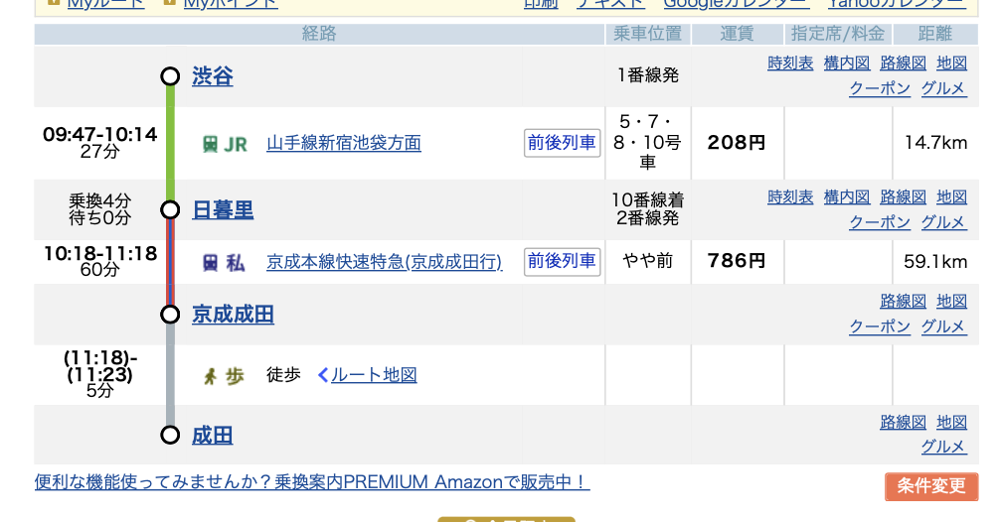
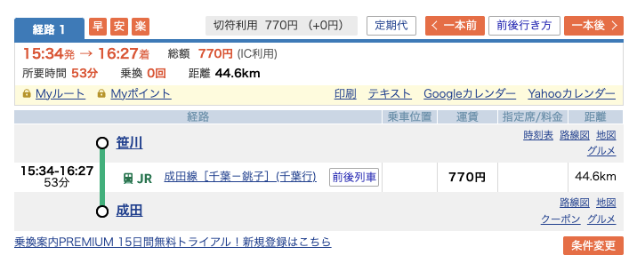

# Connpass

[【帰ってきた開発合宿！】集まれSwift好き！Swift愛好会 vol.78](https://love-swift.connpass.com/event/298750/)
[【帰ってきた開発合宿！】集まれKotlin好き！Kotlin愛好会 vol.48](https://love-kotlin.connpass.com/event/298919/)

# 日程

2023/11/25 ~ 26

# 場所

- 土善旅館
  - [HP](https://www.dozenryokan.com/)
  - 最寄り駅：JR笹川駅
  - チェックインアウト
    - 部屋：15時〜翌10時
    - 開発部屋：12時〜翌15時
    - なのでいなよし後にすぐ開発部屋いける
    - ご飯の時間
      - 夕食：18-19時
      - 朝食：7-8時
    - 酒類の事前配送
      - 289-0601　
      - 千葉県香取郡東庄町笹川い６２４　土善旅館　（お客様名）様
      - 0478-86-1155

# 参加費

- 14500円
  - 宿泊費
  - 1日目夜の夕食(宴会)代
  - 宴会中の飲み物代
  - 開発中の飲み代（持ち込み分）
  - 2日目の朝食・昼食代

# 持ち物

- やっていく気持ち
- 7000円くらい（お昼代や交通費や何かあったときよう
- お菓子（300円まで）
- お土産代　額は各自決めよう
- 開発に使うもの
  - PC
  - 電源類
  - 携帯充電用のUSBの穴があるやつを持っている人は持ってきてくれると嬉しい（電源タップはレンタル
- ディスプレイ用のケーブル
  - 合宿先にも準備はありますが数に限りがあるので各自持ってくること
  - usb-cよりはHDMIで出せると安牌かも
- イヤホン（必要な方）
- 防寒着（11月の香取郡の夜はそれなりに寒そう）
- 着替え
- 下着
- ねまき（浴衣は有料）
  - 夜冷え込むのであたたかめだとよし
- 歯ブラシ
- スポーツタオル * 2
- バスタオル（タオルは有料）
- 髭剃り（髭を剃る人は
- コンタクトの人はメガネ、コンタクトケース
- お化粧する方は化粧品やメイク落とし
- 雨具
- 常備薬必要な方は薬
  - バスに乗るので酔い止め必要な方は酔い止め？
- 健康保険証（or 保険証登録されてるマイナンバーカード）

# スケジュール

## Day1

成田集合 or 東京集合の2パターン

- 9:30 渋谷駅ハチ公前集合
  - 渋谷: 9:47発 -> 成田: 11:18着乗り換え
- 
- 成田合流：11:41発 -> 笹川：12:33着（成田線）
  - 成田線は一時間に一本。乗り遅れたら一時間後
- 12:45 いなよしでごはん
  - https://www.inayosi.com/#menu
  - **事前にオーダーを決めておく**
- 13:50 土善旅館バスに拾ってもらう
- 14:00 チェックイン
- 14:10 開発部屋に集合
- 14:10 （買い出し）
- 19:00 夜ご飯
- 20:00 わいわい談義タイム
- 21:00 自由（お風呂も夜中まで入れるよ！）

## Day2

- 8:00 朝食
- 9:00 開発など
- 10:00 宿泊部屋チェックアウト→荷物は開発部屋へ
- 11:00 成果発表会
- 12:00 お昼ご飯（軽食）
- 15:00 開発部屋チェックアウト&現地解散

- 
  - 早まったら早まったで土善旅館さんと相談して早くに駅に送ってもらう（14時代の電車のったりなんだり
